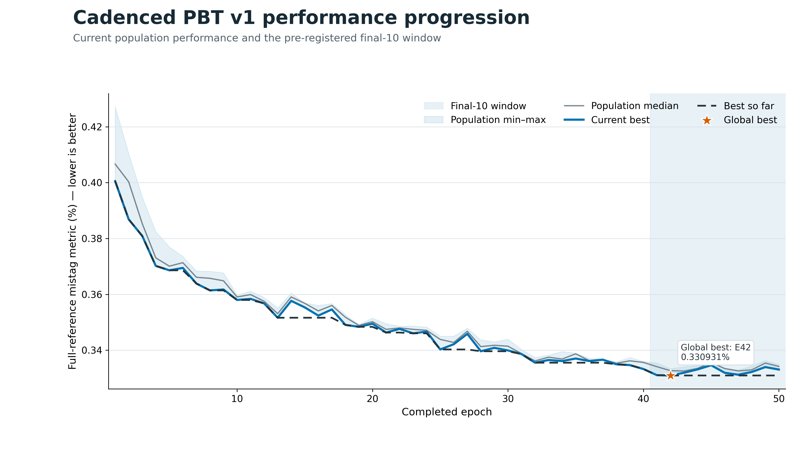
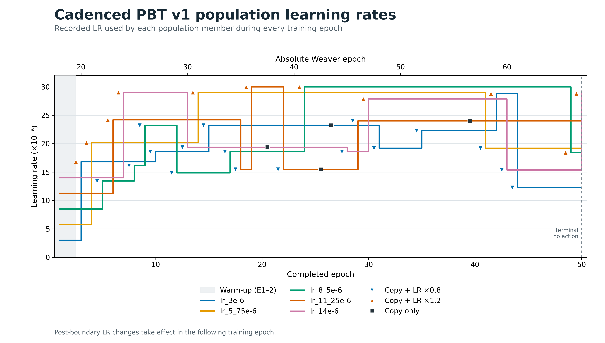
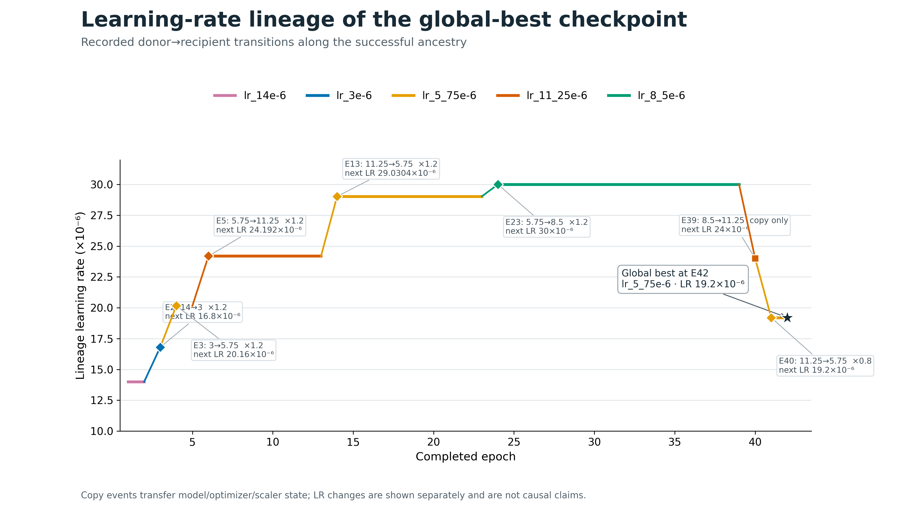
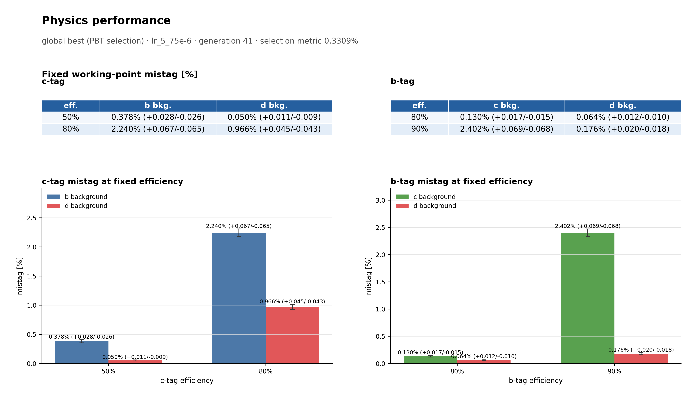
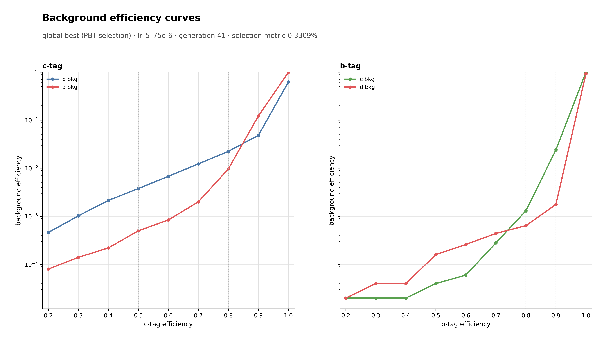

Cadenced PBT v1 — 50 epochs
===========================

Completed pretrained PBT with one-epoch generations, copy and deterministic LR-mutation opportunities after every eligible epoch, a two-epoch warm-up, and five population members.

Primary results
---------------

.. list-table::
   :header-rows: 1
   :widths: 45 55

   * - Quantity
     - Recorded value
   * - Final-10 current-best full-reference mean
     - ``0.3323913294200741``
   * - Global-best full-reference score
     - ``0.3309306510368319``
   * - Global-best completed / Weaver epoch
     - ``42`` / ``59``
   * - Global-best member / LR
     - ``lr_5_75e-6`` / ``1.9200000000000003e-05``
   * - Final-best member / score
     - ``lr_8_5e-6`` / ``0.3330581809576899``

Method and dynamics
-------------------

* Generation length: one epoch.
* Copy and LR mutation opportunity: every epoch after the two-epoch warm-up.
* Initialization: pretrained epoch 17; training seed ``12345``.
* Exploit / mutation / copy-only counts: ``32`` / ``28`` / ``4``.
* Initial-lineage collapse: completed epoch ``5``.
* Five unique live learning rates remained present at every completed epoch.

The figures describe recorded temporal relationships and do not claim that a particular learning-rate mutation caused a later performance improvement.

Performance progression
-----------------------

Population learning rates
-------------------------

Post-boundary LR changes take effect in the following training epoch.

Global-best LR lineage
----------------------

Physics performance
-------------------

The physics figures are the verified recorded outputs. Their best-physics checkpoint is not the primary full-reference PBT global-best checkpoint; the primary selection is unchanged.

Metrics and history
-------------------

* :download:`Recorded metrics <../../published/experiments/cadenced-pbt-v1-50/metrics.csv>`
* :download:`Learning-rate history <../../published/experiments/cadenced-pbt-v1-50/lr_history.csv>`
* :download:`Boundary decisions <../../published/experiments/cadenced-pbt-v1-50/decision_history.csv>`
* :download:`Applied exploit history <../../published/experiments/cadenced-pbt-v1-50/exploit_history.csv>`

Models
------

* ``global_best_state.pt`` — best checkpoint according to the primary full-reference metric, SHA256 ``ab44b098b5f7b11b4b730e4530e5c60d2c616387dbe2fd0761ee070ecf2c60f2``
* ``global_best_optimizer.pt`` — optimizer paired with the primary-metric global best, SHA256 ``d3afc5e126d7dac1398fc449b35ac7f1f6cca8e6e6e8a0b4e425ed02b73de35c``
* ``global_best_scaler.pt`` — AMP scaler paired with the primary-metric global best, SHA256 ``aed8e45e70dd8e00fa34c78942f17fbb24bb11056588b327fe641b57e10c938f``
* ``final_best_state.pt`` — top-ranked population member at the final horizon, SHA256 ``54e015db0508c45e1c3e95ebb39825ede4ad9cb6867f546c6ee6fd511489a8df``

Model files are local release assets and are intentionally excluded from the Pages build.

Provenance and reproducibility
------------------------------

* Canonical server path: ``runs/pbt/cadenced_pbt_v1_50epochs``
* Source commit: ``90fa89d7eeb351fa2c787489f77faea286bbb31a``
* Source manifest SHA256: ``57dcee6b08b7e429adcee6c7c88e2af633fa1a932875bd340a1c88d577ab82a5``
* :download:`Resolved configuration <../../published/experiments/cadenced-pbt-v1-50/config.yaml>`
* :download:`Publication provenance <../../published/experiments/cadenced-pbt-v1-50/provenance.json>`
