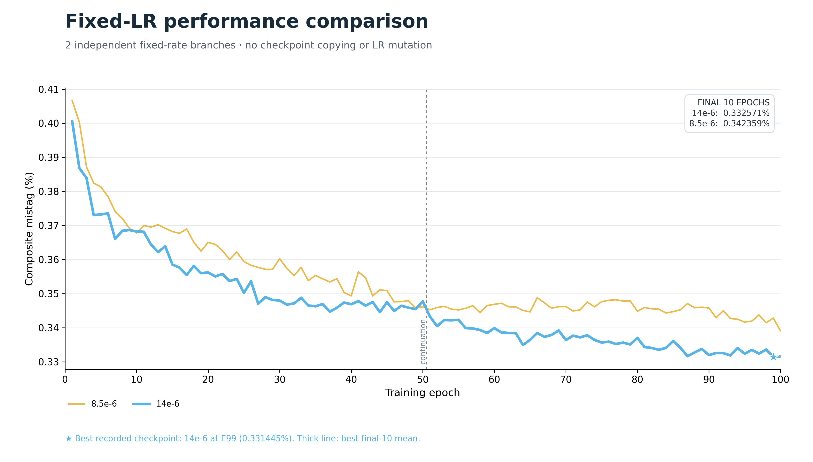
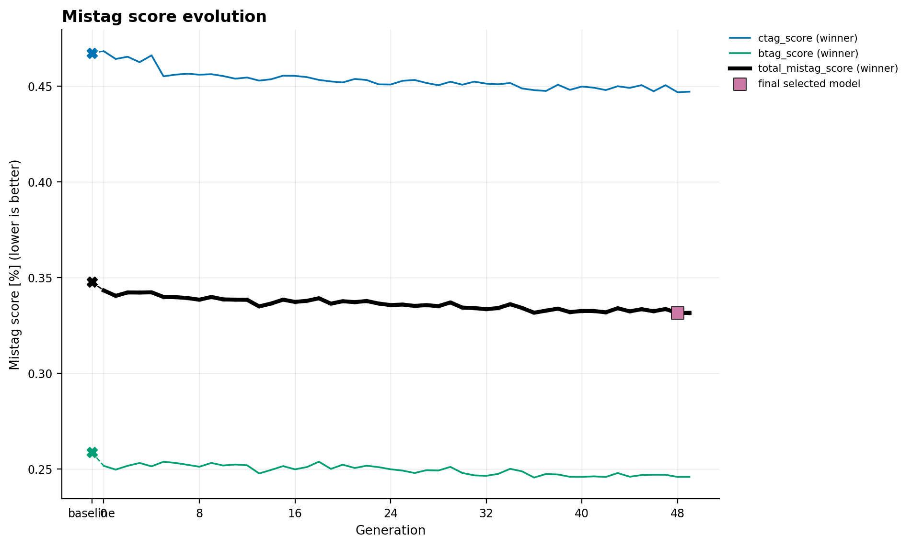
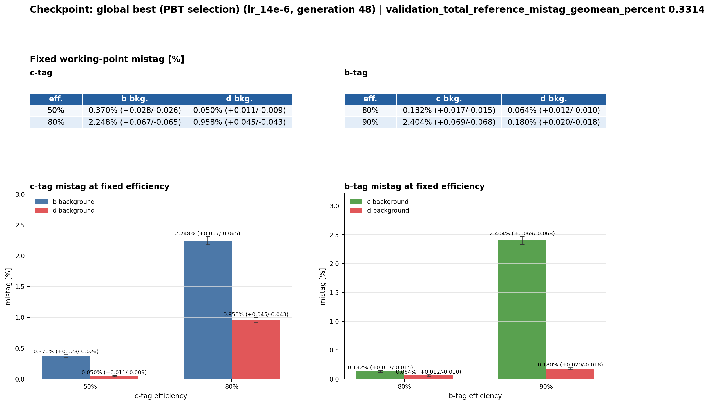

Fixed-LR baseline — 100 epochs
==============================

Matched 14e-6 and 8.5e-6 fixed-learning-rate branches continued from epoch 50 to epoch 100.

Result summary
--------------

* Status: ``completed``
* Method: ``fixed_lr_grid``
* Seed: ``12395``
* Horizon: ``50``
* Best recorded metric: ``0.33144525337790737`` (validation_total_reference_mistag_geomean_percent)
* Recorded baseline metric: ``0.34772519582058087``
* Relative improvement against the recorded baseline: ``4.6818%``

Key plots
---------

Metrics and history
-------------------

* :download:`Recorded metrics <../../published/experiments/fixed-lr-100/metrics.csv>`
* :download:`Learning-rate history <../../published/experiments/fixed-lr-100/lr_history.csv>`
* This run has no exploit history.

Models
------

No model checkpoint is included in this publication bundle.

Provenance and reproducibility
------------------------------

* Canonical server path: ``runs/pbt/fixed_lr_continuation_20260917_lr_14e-6``
* Source commit: ``68cc7fbbb6d092ea4038c9c7f400c1780a938ef3``
* Source manifest SHA256: ``ff3e2d751a44d2649cd31a5a53f97c951021dfda283c6d07bde94fe02134e3cc``
* :download:`Resolved configuration <../../published/experiments/fixed-lr-100/config.yaml>`
* :download:`Publication provenance <../../published/experiments/fixed-lr-100/provenance.json>`
