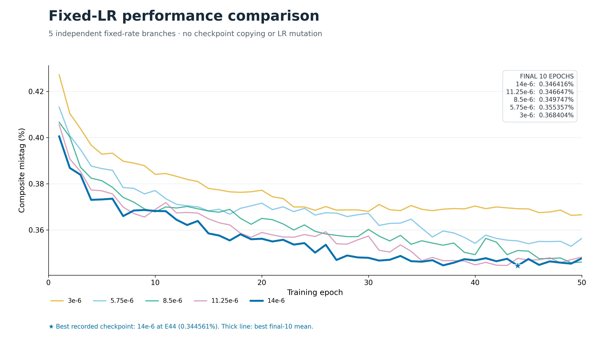
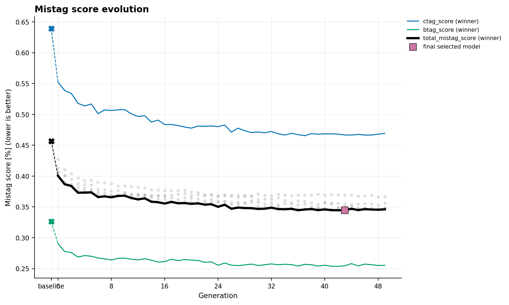
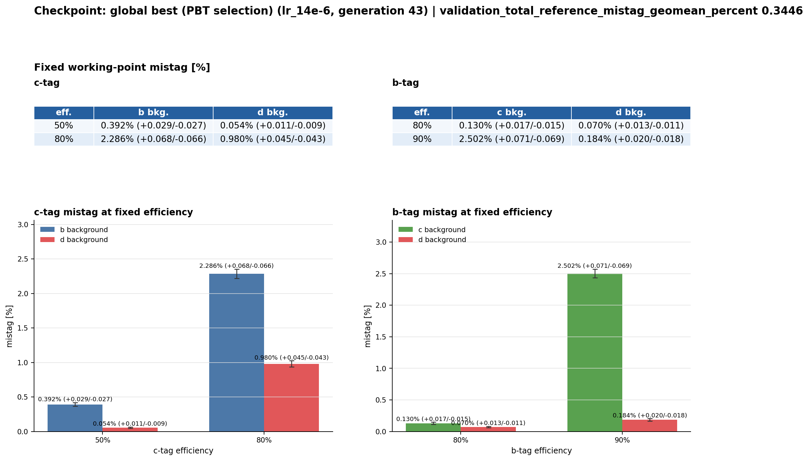

Fixed-LR baseline — 50 epochs
=============================

Matched five-member fixed-learning-rate control through 50 full epochs.

Result summary
--------------

* Status: ``completed``
* Method: ``fixed_lr_grid``
* Seed: ``12345``
* Horizon: ``50``
* Best recorded metric: ``0.34456096962514227`` (validation_total_reference_mistag_geomean_percent)
* Recorded baseline metric: ``0.456704817784357``
* Relative improvement against the recorded baseline: ``24.5550%``

Key plots
---------

Metrics and history
-------------------

* :download:`Recorded metrics <../../published/experiments/fixed-lr-50/metrics.csv>`
* :download:`Learning-rate history <../../published/experiments/fixed-lr-50/lr_history.csv>`
* This run has no exploit history.

Models
------

No model checkpoint is included in this publication bundle.

Provenance and reproducibility
------------------------------

* Canonical server path: ``runs/pbt/foundation_fixed_lr_50epochs_20260916``
* Source commit: ``e2a70c6775ca0896942d2c2fb8a481c7be5fdb5e``
* Source manifest SHA256: ``ac32758770f4755ef7cdaec3fe4342760105830b83b8d01438bb2643038766b8``
* :download:`Resolved configuration <../../published/experiments/fixed-lr-50/config.yaml>`
* :download:`Publication provenance <../../published/experiments/fixed-lr-50/provenance.json>`
