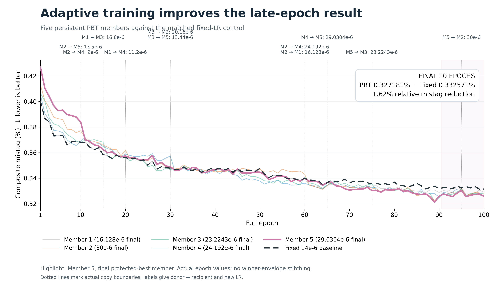
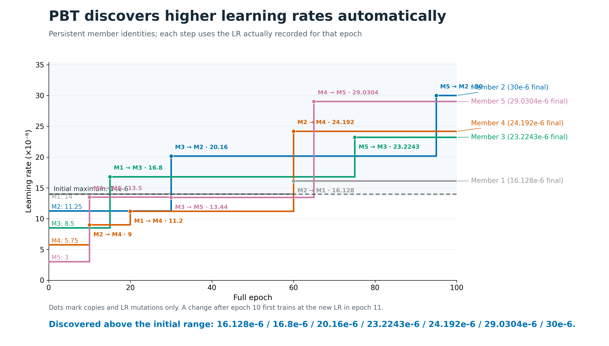
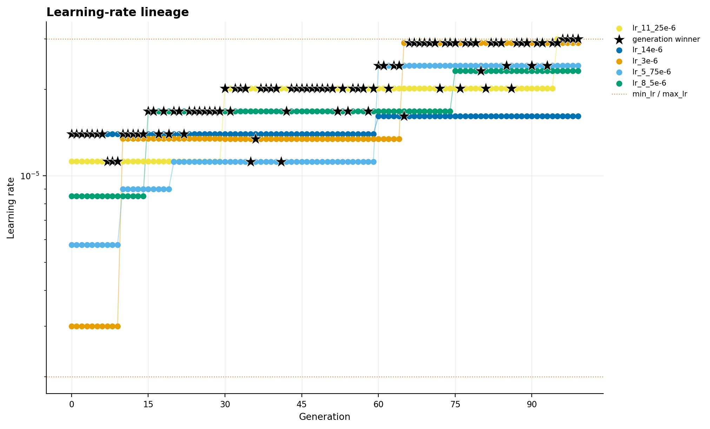

PBT v2 — 100 epochs
===================

Verified continuation of the frozen windowed PBT v2 population through 100 full epochs.

Result summary
--------------

* Status: ``completed``
* Method: ``windowed_pbt_v2``
* Seed: ``12345``
* Horizon: ``100``
* Best recorded metric: ``0.32138124685977204`` (validation_total_reference_mistag_geomean_percent)
* Recorded baseline metric: ``0.456704817784357``
* Relative improvement against the recorded baseline: ``29.6304%``

Key plots
---------

Metrics and history
-------------------

* :download:`Recorded metrics <../../published/experiments/pbt-v2-100/metrics.csv>`
* :download:`Learning-rate history <../../published/experiments/pbt-v2-100/lr_history.csv>`
* :download:`Exploit history <../../published/experiments/pbt-v2-100/exploit_history.csv>`

Models
------

* ``best_single_state.pt`` — epoch 106, lowest recorded individual metric, SHA256 ``9dd5319c225603dd29fcd6a0cb33a72f2b5610d62e8bf2dda96174209dd6691d``
* ``protected_best_state.pt`` — epoch 107, best protected window selection, SHA256 ``453f5de6edacad6fff221288b21a70642eb77210ec9e8db48f9d045ce91fe121``
* ``final_best_state.pt`` — epoch 117, top-ranked member at the final horizon, SHA256 ``7818184249838cc70bc58dc3e3a556ec0655071e747fa42a58201f78ba9bdad6``

Model files are prepared as release assets and are intentionally excluded from the Pages build.

Provenance and reproducibility
------------------------------

* Canonical server path: ``runs/pbt/windowed_pbt_v2_100epochs``
* Source commit: ``59b9a3a92b5f8b2241817a1facbc71e097e13fdd``
* Source manifest SHA256: ``6baf6613787787635b054043a453b0334726fc2bb446178d48e9d790ecb64bb8``
* :download:`Resolved configuration <../../published/experiments/pbt-v2-100/config.yaml>`
* :download:`Publication provenance <../../published/experiments/pbt-v2-100/provenance.json>`
