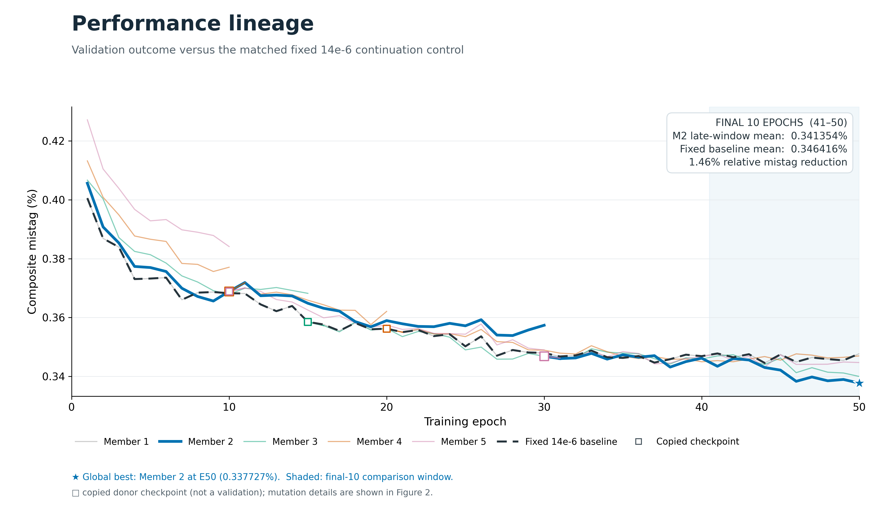
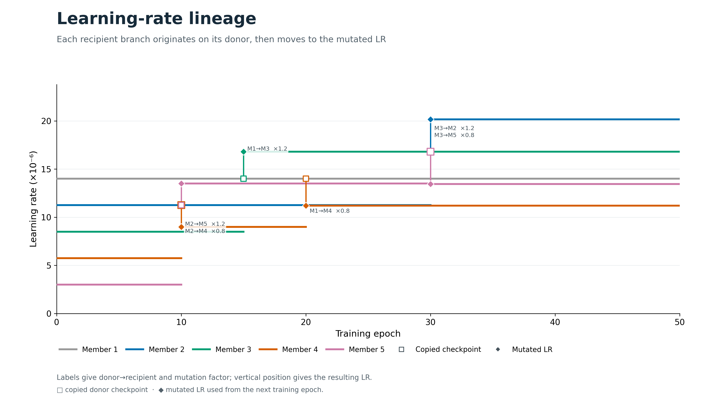

PBT v2 — 50 epochs
==================

Verified 50-full-epoch reference run and immutable continuation ancestor.

Result summary
--------------

* Status: ``completed``
* Method: ``windowed_pbt_v2``
* Seed: ``12345``
* Horizon: ``50``
* Best recorded metric: ``0.337726899098497`` (validation_total_reference_mistag_geomean_percent)
* Recorded baseline metric: ``0.456704817784357``
* Relative improvement against the recorded baseline: ``26.0514%``

Key plots
---------

Metrics and history
-------------------

* :download:`Recorded metrics <../../published/experiments/pbt-v2-50/metrics.csv>`
* :download:`Learning-rate history <../../published/experiments/pbt-v2-50/lr_history.csv>`
* :download:`Exploit history <../../published/experiments/pbt-v2-50/exploit_history.csv>`

Models
------

* ``best_single_state.pt`` — epoch 67, lowest recorded individual metric, SHA256 ``e29d7a766993d37172f6901992d4dbd35321946f491cb4f3adb33f0556246837``
* ``protected_best_state.pt`` — epoch 67, best protected window selection, SHA256 ``e29d7a766993d37172f6901992d4dbd35321946f491cb4f3adb33f0556246837``
* ``final_best_state.pt`` — epoch 67, top-ranked member at the final horizon, SHA256 ``e29d7a766993d37172f6901992d4dbd35321946f491cb4f3adb33f0556246837``

Model files are prepared as release assets and are intentionally excluded from the Pages build.

Provenance and reproducibility
------------------------------

* Canonical server path: ``runs/pbt/windowed_pbt_v2``
* Source commit: ``a4f750793911508812b5b09296afe5306306c930``
* Source manifest SHA256: ``fb1964a8f2d6d087008297ffad1ac3dac6499ecb156079de41d0c9e5e7e523b6``
* :download:`Resolved configuration <../../published/experiments/pbt-v2-50/config.yaml>`
* :download:`Publication provenance <../../published/experiments/pbt-v2-50/provenance.json>`
