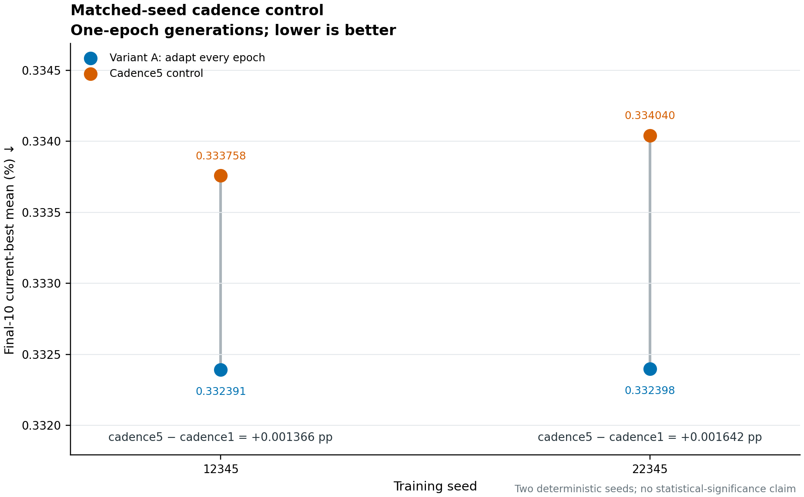
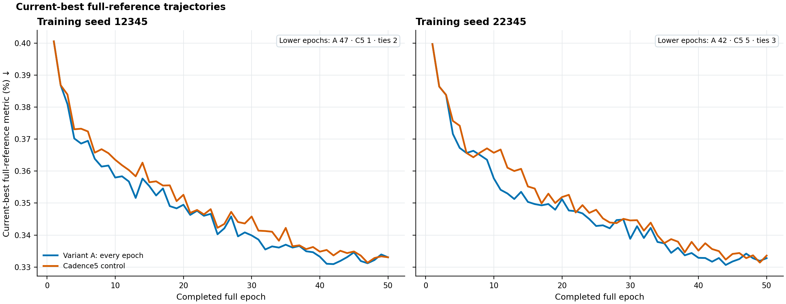
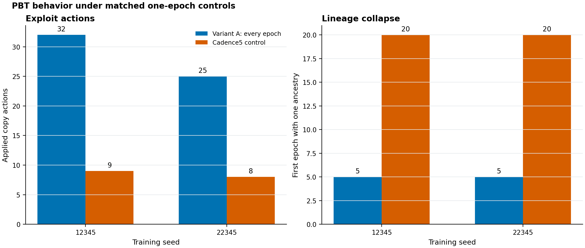

PBT interim technical status
============================

This milestone separates four experiment roles that must not be conflated:

.. list-table:: Current experiment matrix
   :header-rows: 1
   :widths: 25 18 19 19 19

   * - Experiment
     - Generation
     - Copy opportunity
     - LR opportunity
     - Status
   * - Historical ``windowed_pbt_v2``
     - 1 epoch
     - windowed policy
     - windowed policy
     - DONE; not cadence-only
   * - Supervisor Variant A, ``cadenced_pbt_v1``
     - 1 epoch
     - every epoch
     - every epoch
     - DONE and validated
   * - Cadence5 control
     - 1 epoch
     - every 5 epochs
     - every 5 epochs
     - CONTROL; done and validated
   * - Supervisor Variant B
     - 0.2 epoch
     - every generation
     - every 5 generations
     - BLOCKED before implementation
   * - Full scratch comparison
     - 1 epoch
     - Variant-A policy
     - Variant-A policy
     - TODO; smoke only is done

Matched-seed cadence control
----------------------------

The cadence5 control isolates intervention frequency without also changing
generation length, worker-restart frequency, data partitioning or the
historical optimizer contract.  The primary endpoint is the final-10
current-best full-reference mean; lower is better.

.. list-table:: Completed pretrained matched-seed results
   :header-rows: 1
   :widths: 12 22 22 22 22

   * - Seed
     - Variant A
     - Cadence5
     - Cadence5 minus A
     - Lower epochs A/C5/tie
   * - 12345
     - **0.332391329420**
     - 0.333757664732
     - +0.001366335312
     - 47 / 1 / 2
   * - 22345
     - **0.332398320401**
     - 0.334039837954
     - +0.001641517554
     - 42 / 5 / 3

Variant A had the lower primary endpoint and global best for both deterministic
training seeds.  It was lower in 89 of 100 paired epochs.  This direction has
replicated twice under the current pretrained setup, but two seeds do not
establish statistical significance or general cadence superiority.  The
configured 0.002 margin is an operational policy threshold, not a significance
test.

Variant B blocker
-----------------

Ranger is RAdam wrapped by Lookahead.  Historical checkpoints preserve RAdam
state but omit Lookahead slow weights and its step counter, and the supervisor
starts a fresh Weaver process for every generation.  The deterministic
one-epoch-versus-five-chunk gate matched sample order, optimizer-step count,
AMP scaler, LR and RNG continuation, but model and optimizer states diverged;
the observed maximum model-parameter difference was 7.5928867e-4.

Implementing corrected serialization only in Variant B would confound cadence
with optimizer continuation.  The rigorous route is a new, versioned full-
Lookahead checkpoint contract, a restarted-continuation equivalence proof, and
two newly matched corrected A/B strategies.  Historical Variant A must not be
reused as that corrected comparator.

Scratch remains a separate robustness track.  Its semantics and CPU tests are
complete and the real three-generation smoke passed, but no 50-epoch scratch
production comparison has run.

Full supervisor brief and evidence
----------------------------------

The :download:`Markdown supervisor brief <reports/PBT_INTERIM_TECHNICAL_STATUS.md>`
contains the full interpretation, immutable run paths, commits, config hashes,
source provenance and next-step decision tree.  The machine-readable
:download:`evidence table <_static/results/pbt_interim_metrics.json>` records
the plotted trajectories and calculations.  All figures read completed run
artifacts only.
