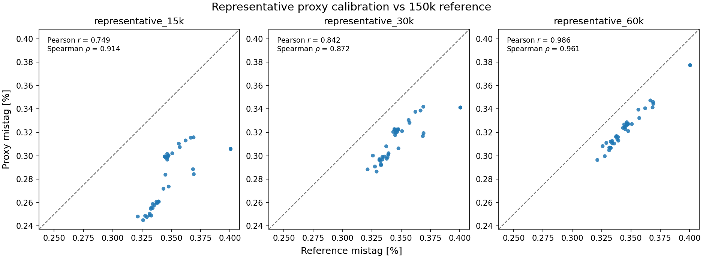
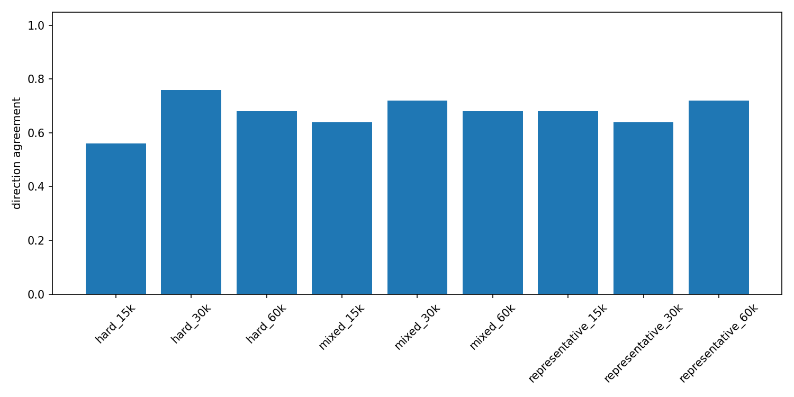
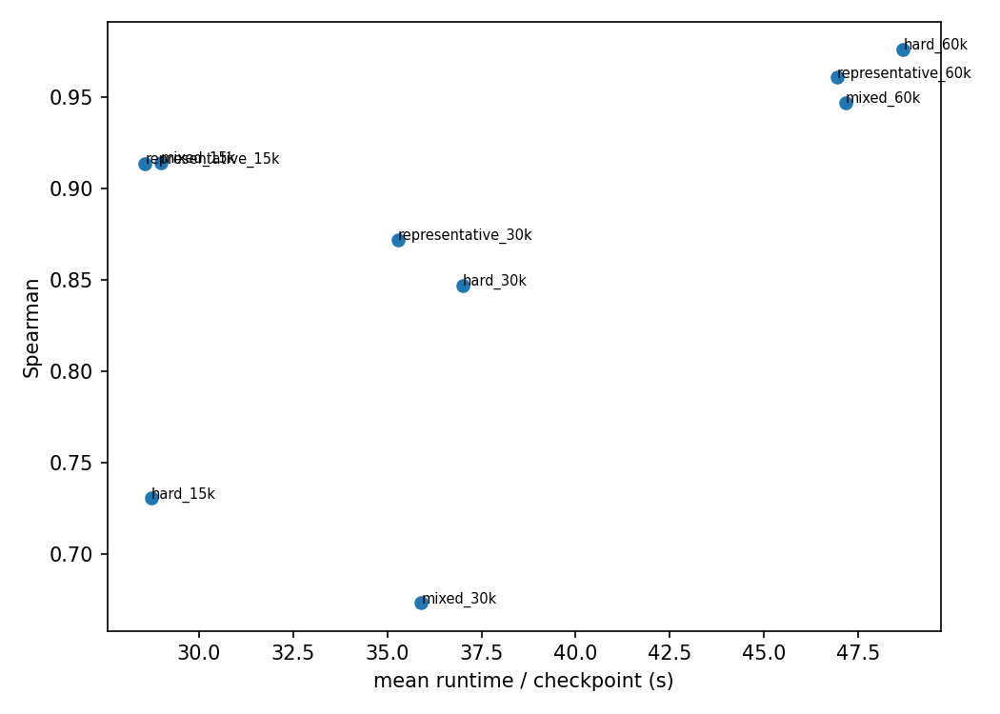

Proxy-validation qualification
==============================

Full reference validation uses 150,000 events and is too expensive for frequent
controller feedback. We tested smaller frozen subsets on 38 saved model states
spanning different stages and performance levels of previous
fixed-LR and PBT runs. The goal was a cheaper signal that still tracks physics
performance. No training or learning-rate changes occurred in this offline
experiment. The qualified choice is **representative_60k**.

``training → frequent proxy validation → local adaptive LR → periodic PBT``

Calibration against the reference
---------------------------------

   Each point is one checkpoint. X is the 150k reference mistag, Y is proxy
   mistag, and the dashed line is perfect absolute calibration.

The 60k relationship is visibly tighter than at 15k or 30k:
``representative_60k`` reaches **Pearson 0.986** and **Spearman 0.961**.
Pearson measures linear agreement; Spearman measures whether checkpoint ranking
is preserved. The points remain below the diagonal, so the proxy is useful for
comparison but is not a perfectly calibrated replacement for the reference.

What was tested
---------------

.. list-table:: Compact experiment design
   :header-rows: 0
   :widths: 24 76

   * - **Reference**
     - 150k events = 50k b + 50k c + 50k light
   * - **Checkpoint panel**
     - 38 unique model states from fixed-LR and PBT trajectories
   * - **Candidates**
     - representative / hard / mixed × 15k / 30k / 60k = 9 proxies
   * - **Total**
     - 38 × 9 = 342 evaluations
   * - **Representative**
     - Deterministic, class-balanced sample
   * - **Hard**
     - Difficult events enriched by frozen-anchor predictive entropy
   * - **Mixed**
     - 70% representative + 30% hard

Can it follow a changing trajectory?
------------------------------------

Ranking different checkpoints is not enough: a controller must also detect
whether the same trajectory just improved or degraded. For
``representative_60k``, temporal direction agreement is **0.720**. A future
controller must therefore use smoothing, short-window trends and patience
rather than react to one measurement.

Is it cheap enough to use frequently?
-------------------------------------

``representative_60k`` takes **46.93 s** per checkpoint, is **5.33× faster**
than the reference evaluation, and retains **Spearman 0.961**. This is the
practical cost/quality tradeoff needed for shadow measurements between coarse
PBT decisions.

Why ``representative_60k``
--------------------------

**Selected proxy: representative_60k**

* Pearson **0.986**; Spearman **0.961**
* Pairwise agreement **0.919**; temporal agreement **0.720**
* Zero observed best-checkpoint regret
* **5.33×** faster than the full reference
* Only candidate satisfying the complete predeclared qualification rule

``hard_60k`` has slightly stronger pure ranking (Spearman 0.976; pairwise
0.940), but worse temporal agreement (0.680), non-zero regret, and a
distribution-shifted hard-enriched raw metric. The selection was therefore not
simply “take the highest correlation.”

Meaning and next step
---------------------

.. list-table:: Scope of the result
   :header-rows: 1
   :widths: 50 50

   * - Established
     - Not established
   * - ``representative_60k`` is a qualified cheaper measurement signal.
     - Adaptive LR improves training.

**Next:** ``offline controller replay → shadow controller → controlled adaptive-LR experiment``

Technical details and supplementary figures
--------------------------------------------

The :doc:`technical supplement <proxy_validation_details>` contains the full
nine-candidate table, qualification rule, bootstrap and integrity checks, the
full 3×3 scatter matrix, and per-working-point diagnostics.

.. toctree::
   :hidden:

   proxy_validation_details
