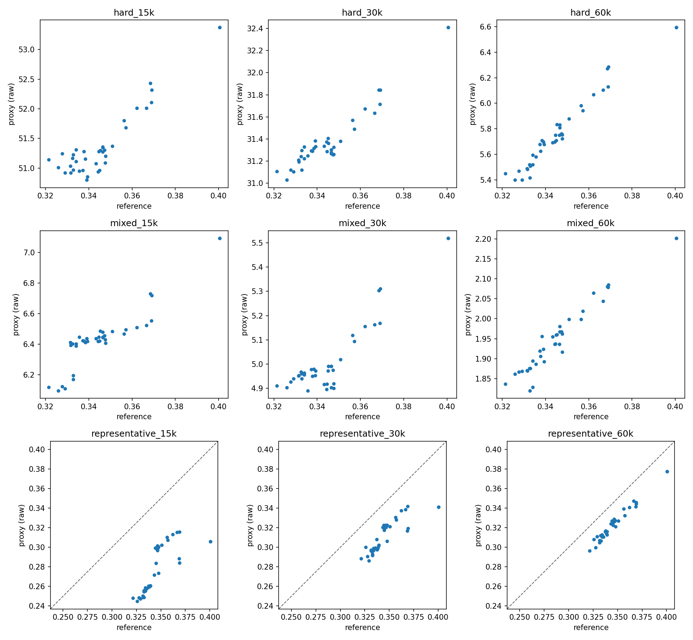
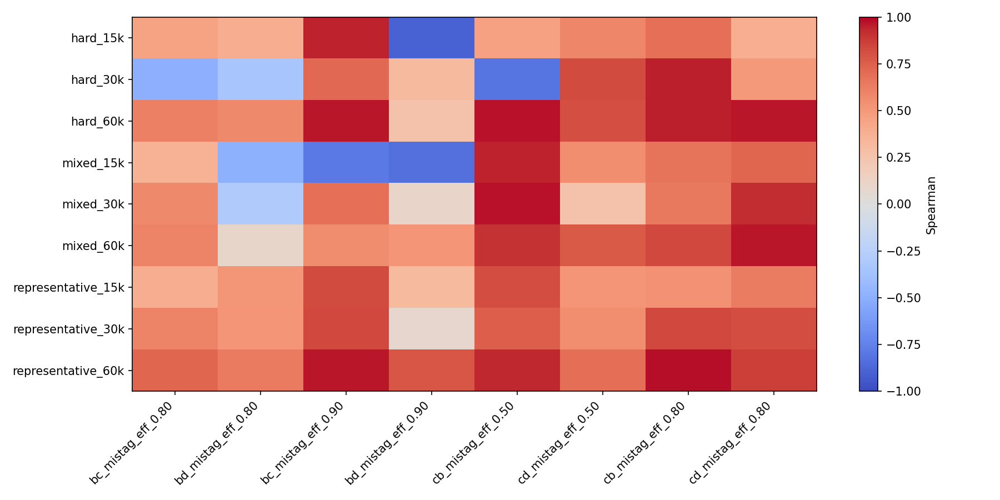

Proxy-validation technical supplement
======================================

This page preserves the numerical and reproducibility detail behind the concise
:doc:`proxy-validation result <proxy_validation>`. The exact finalized
:download:`qualification summary <_static/proxy_validation/qualification_summary.json>`
is available as JSON.

Full results
------------

.. list-table:: Proxy qualification results
   :header-rows: 1
   :widths: 18 9 9 16 10 10 10 18

   * - Proxy
     - Pearson
     - Spearman
     - Spearman 95% CI
     - Pairwise
     - Temporal
     - Regret (pp)
     - Runtime / speedup
   * - ``representative_15k``
     - 0.749
     - 0.914
     - 0.591–0.967
     - 0.893
     - 0.680
     - 0.0045
     - 28.57 s / 8.76×
   * - ``hard_15k``
     - 0.928
     - 0.730
     - 0.347–0.912
     - 0.781
     - 0.560
     - 0.0177
     - 28.74 s / 8.71×
   * - ``mixed_15k``
     - 0.920
     - 0.914
     - 0.170–0.942
     - 0.889
     - 0.640
     - 0.0045
     - 28.99 s / 8.63×
   * - ``representative_30k``
     - 0.842
     - 0.872
     - 0.426–0.959
     - 0.857
     - 0.640
     - 0.0077
     - 35.28 s / 7.09×
   * - ``hard_30k``
     - 0.962
     - 0.847
     - 0.224–0.963
     - 0.848
     - 0.760
     - 0.0045
     - 37.01 s / 6.76×
   * - ``mixed_30k``
     - 0.918
     - 0.673
     - −0.300–0.957
     - 0.776
     - 0.720
     - 0.0142
     - 35.90 s / 6.97×
   * - ``representative_60k``
     - 0.986
     - 0.961
     - 0.847–0.975
     - 0.919
     - 0.720
     - 0.0000
     - 46.93 s / 5.33×
   * - ``hard_60k``
     - 0.981
     - 0.976
     - 0.943–0.980
     - 0.940
     - 0.680
     - 0.0077
     - 48.70 s / 5.14×
   * - ``mixed_60k``
     - 0.969
     - 0.947
     - 0.635–0.969
     - 0.920
     - 0.680
     - 0.0114
     - 47.17 s / 5.30×

Qualification and uncertainty
-----------------------------

The predeclared rule required Spearman ≥ 0.8, pairwise agreement ≥ 0.8,
temporal direction agreement ≥ 0.7, and a bootstrap Spearman 95% lower bound
≥ 0.5. ``representative_60k`` was the only candidate satisfying all four.

Ranking uncertainty used 50 paired, class-stratified event bootstrap replicates
per candidate, with identical resampled indices across checkpoints. All 450
planned replicates completed. All 72 candidate/working-point statistic blocks
were also computed.

Integrity and reproducibility
-----------------------------

The 38-state panel was deduplicated by model-state SHA256 and deliberately
included weak, medium, strong, intermediate, final, protected and global-best
states. Proxy membership was frozen before evaluation, so every checkpoint saw
the same events within one candidate.

All 342 checkpoint/proxy results were checked for checkpoint SHA, proxy
manifest SHA, required metrics, and prediction parquet existence, schema and
row count. No canonical checkpoint or source-run manifest was modified.
Construction and qualification are implemented in
``scripts/validation/build_proxy_sets.py`` and
``scripts/validation/qualify_proxy.py``; recorded evidence is under
``runs/eval/proxy_qualification_v1``.

Supplementary figures
---------------------

Hard and mixed proxies are distribution-enriched, so their raw vertical scales
are not directly calibrated to the natural reference distribution.

   Representative, hard and mixed proxy scatter plots at all three sizes.

The per-working-point heatmap checks whether aggregate agreement hides behavior
at individual b-tag and c-tag operating points.

